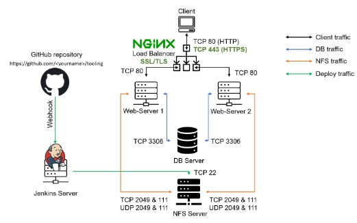
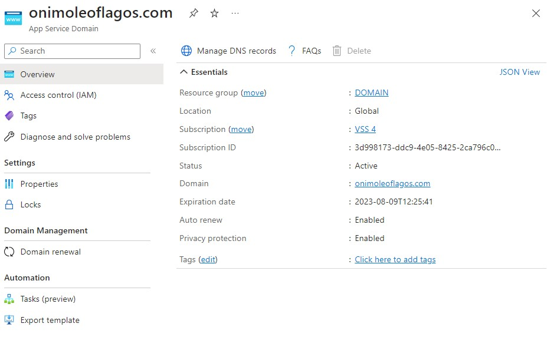
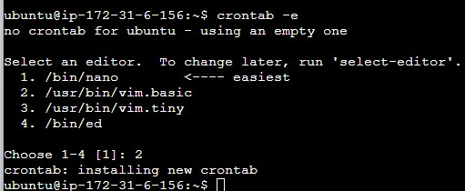

## LOAD BALANCER SOLUTION WITH NGINX AND SSL/TLS

### Task

This project consists of two parts:

1.  Configure Nginx as a Load Balancer
 
  
2.  Register a new domain name and configure secured connection using SSL/TLS certificates

Your target architecture will look like this:

## CONFIGURE NGINX AS A LOAD BALANCER

You can either uninstall Apache from the existing Load Balancer server, or create a fresh installation of Linux for Nginx.

1.  Create an EC2 VM based on Ubuntu Server 20.04 LTS and name it `Nginx LB` (do not forget to open TCP port 80 for HTTP connections, also open TCP port 443 – this port is used for secured HTTPS connections)

  
  

2.  Update `/etc/hosts` file for local DNS with Web Servers’ names (e.g. `Web1` and `Web2`) and their local IP addresses

    

3. Install and configure Nginx as a load balancer to point traffic to the resolvable DNS names of the webservers

Update the instance and Install Nginx

`sudo apt update`

`sudo apt install nginx`

Configure Nginx LB using Web Servers’ names defined in /etc/hosts

Hint: Read this blog to read about `/etc/host`

Open the default nginx configuration file

`sudo vi /etc/nginx/nginx.conf`

insert following configuration into http section

 upstream myproject {
    server Web1 weight=5;
    server Web2 weight=5;
  }

server {
    listen 80;
    server_name www.domain.com;
    location / {
      proxy_pass http://myproject;
    }
  }

#comment out this line
#       include /etc/nginx/sites-enabled/*;

Restart Nginx and make sure the service is up and running

`sudo systemctl restart nginx`

`sudo systemctl status nginx`

REGISTER A NEW DOMAIN NAME AND CONFIGURE SECURED CONNECTION USING SSL/TLS CERTIFICATES

In order to get a valid SSL certificate, I registered a new domain name. 

1. I purchased the domain name - `onimoleoflagos.com` from Azure.

2. Assign an Elastic IP to your Nginx LB server and associate your domain name with this Elastic IP

  

3. Update A record in your registrar to point to Nginx LB using Elastic IP address

  

  Restart the web service on your webservers

    `sudo systemctl restart httpd`

    `sudo systemctl status httpd`

    

    

    Check that the Web Servers can be reached from the browser using new domain name using HTTP protocol – http://www.onimoleoflagos.com

  

4. Configure Nginx to recognize your new domain name

5. Install certbot and request for an SSL/TLS certificate

  Make sure snapd service is active and running

  `sudo systemctl status snapd`

  

  Install certbot

  `sudo snap install --classic certbot`

  

  Request your certificate (just follow the certbot instructions – you will need to choose which domain you want your certificate to be issued for, domain name will be looked up from nginx.conf file)

  `sudo ln -s /snap/bin/certbot /usr/bin/certbot`

  `sudo certbot --nginx`

  

  
  Test secured access to your Web Solution by trying to reach `https://onimoleoflagos.com`

6. Set up periodical renewal of your **SSL/TLS** certificate

  By default, **LetsEncrypt** certificate is valid for **90 days**, so it is recommended to renew it at least every **60 days** or more frequently.

  You can test renewal command in dry-run mode

  `sudo certbot renew --dry-run`

  

  Best practice is to have a scheduled job that to run renew command periodically. Let us configure a `cronjob` to run the command twice a day.

To do so, lets edit the crontab file with the following command:

`crontab -e`

Add following line:

`* */12 * * *   root /usr/bin/certbot renew > /dev/null 2>&1`

